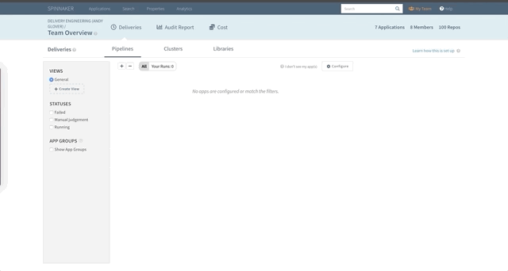

# Spinnaker Custom Banners

[Spinnaker](https://www.spinnaker.io) supports a concept of "custom banners" for each application.
At Netflix, we've used this feature for easter eggs and just making life a little more fun.
These are the Netflix custom banners for the Spinnaker microservices themselves, which you can feel free to copy into your own installation.

# How to Install

For a given app, go to the `Config` page, find the `Custom Banners` section and paste the code snippet into the text box.
